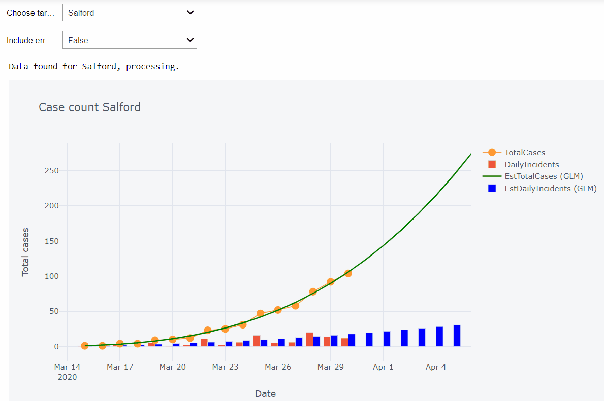
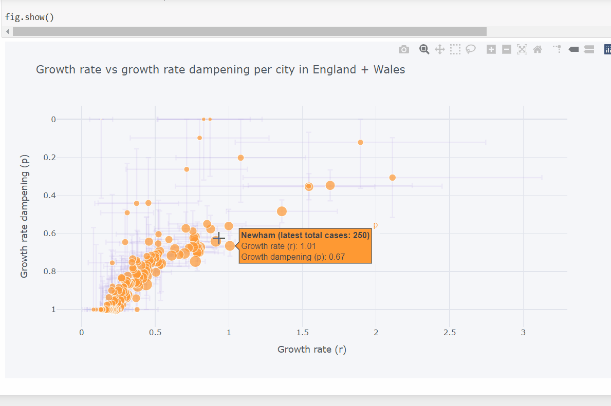

# UKCOVID-CityLevelOutbreakModels

A quick and straightforward framework to perform short-term forecasting when only Total Case data (i.e. cumulative number of positively tested cases) is available. This is the case for UK local authority-level data, which are only reporting cumulative case counts, collated [here](https://github.com/tomwhite/covid-19-uk-data). We follow the methodology outlined in this paper, including bootstrapping to derive confidence intervals: [Short-term Forecasts of the COVID-19 Epidemic in Guangdong and Zhejiang, China](https://www.mdpi.com/2077-0383/9/2/596).

It's deliberately simple, and at the very least lets us visualise and forecast from case-only data across hundreds of UK cities:

By fitting each city to the Generalized Logistic Growth Model, we can compare early-stage growth rates (r) and dampening factors (p). The dampening factors indicate whether the growth in that city is exponential (p=1), polynomial (0<p<1) or linear (p=0).

(For details see the paper: [A generalized-growth model to characterize the early ascending
phase of infectious disease outbreaks](https://www.ncbi.nlm.nih.gov/pmc/articles/PMC4903879/pdf/main.pdf)).

Some implementation details:

There is a Model class which provides a general framework to specify a function that describes case growth, fit the data, bootstrap confidence intervals, visualise forecasts, and assess performance through RMSE. It is very bare-bones as meant to be exploratory/a useful starting point for a more detailed analysis. The Generalized Logistic Growth Model and Richards Model are available, both of which describe case growth through ODEs, which are numerically integrated and fitted to the data.

There is an Epidemic class of UK-level case data as well as population meta-data, with some methods to make it easier to fit models across all cities.

I've uploaded it on request and just in case it's useful for anyone else trying to explore UK data. Documenting is a little on the sparse side as I've been hit by a flu myself, so apologies if anything is unclear. Please do contact me for details if needed.

Binder to play with a few interactive plots using parameters cached on 31/03/20.

.ipynb)
